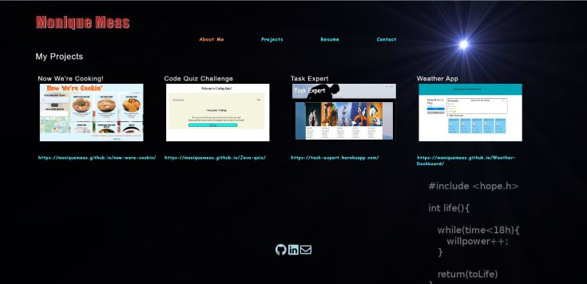

# Just Another Text Editor

 # Badges: 
  

  # GitHub username: moniquemeas
    

  # Description:
  This is a single page application portfolio built by REACT. Use to show your projects, resume and contact form.

  # Preview
  
   

   

   

   

  # How to use
  * Clone the repo.
  * Run npm install
  * Run npms start to start the server on port 3000. http://localhost:3000/

  # Technology:

  * JavaScript
  * REACT
  

  # Deployment Link:

    
 
  
  # Contributing:
  Monique Meas
    
  # License:
  * MIT
  * To find out more about MIT go to:
  * https://opensource.org/licenses/MIT
    
  # Contact:
  monique.meas@gmail.com